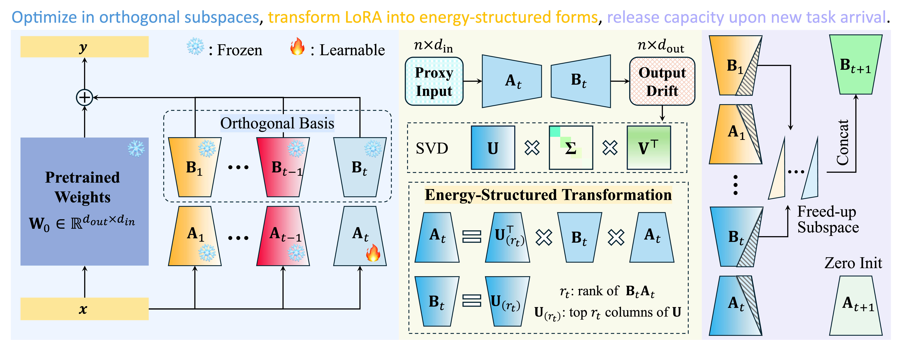
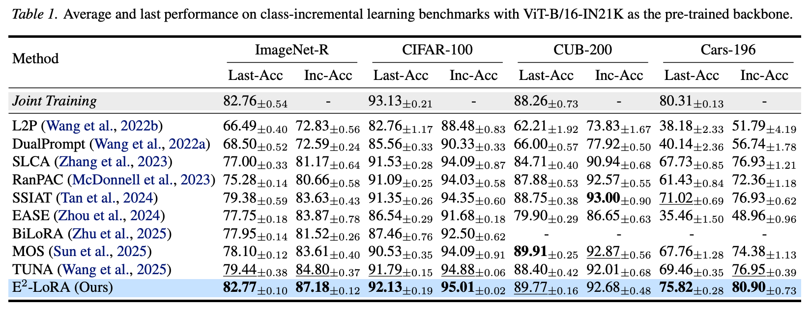
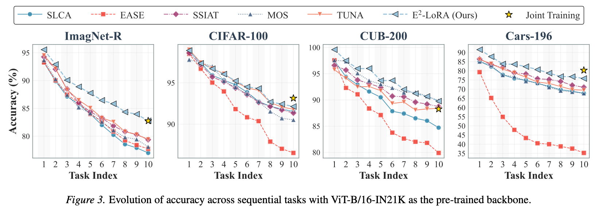
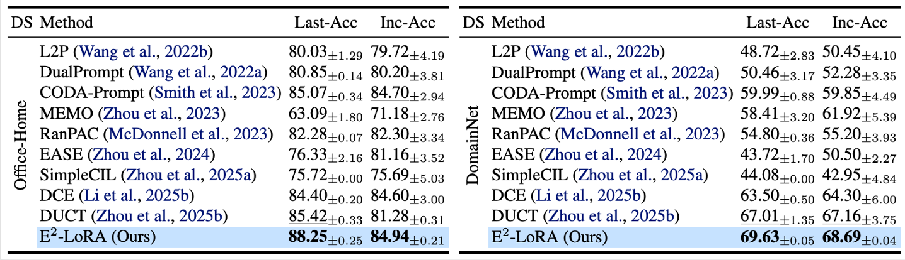

# E²-LoRA: Energy-Efficient Low-Rank Adaptation for Continual Learning

Official implementation of [**E²-LoRA**](https://arxiv.org/abs/2605.27482) — a method that mitigates catastrophic forgetting in continual learning via output feature drift-aware low-rank adaptation.

## Method Overview

E²-LoRA assigns independent LoRA modules ($\Delta W = BA$) to each task. After training, PCA (SVD) is performed on the LoRA-induced output feature drift matrix $\Delta Y = BAX$, producing an orthonormal basis $U$ sorted by singular value energy. LoRA parameters $B$ are aligned to this basis, concentrating knowledge into high-energy ranks. When new tasks arrive, low-energy ranks of old tasks are released and re-initialized as new task parameters. A dynamic rank allocation scheme jointly considers old-task energy retention and new-task minimum rank requirements.

Auxiliary techniques include self-distillation on old class logits and classifier alignment.



## Results

### Class-Incremental Learning




### Domain-Incremental Learning



## Requirements

```bash
conda env create -f environment.yml
conda activate e2lora
```

Or install manually:

```bash
pip install -r requirements.txt
```

## Code Structure

```
E2-LoRA/
├── class_incremental_learning/   # CIL benchmark (based on PyCIL)
│   ├── models/                   # E²-LoRA learner + base class
│   ├── utils/                    # Data loading, training utilities, LoRA network
│   ├── backbone/                 # Classifier head
│   ├── exps/                     # Experiment config files
│   └── main.py                   # Entry point
└── domain_incremental_learning/  # DIL benchmark (based on DUCT)
    ├── methods/                  # E²-LoRA learner + base class
    ├── models/                   # LoRA network + classifier head
    ├── utils/                    # Data loading, training utilities
    ├── configs/                  # Experiment config files
    └── main.py                   # Entry point
```

## Quick Start

See [class_incremental_learning/README.md](class_incremental_learning/README.md) and [domain_incremental_learning/README.md](domain_incremental_learning/README.md) for detailed usage instructions.

## Acknowledgments

- Our CIL framework is built upon [PyCIL](https://github.com/LAMDA-CL/PyCIL) — thanks for their comprehensive CIL codebase.
- Our DIL framework is built upon [DUCT](https://github.com/Estrella-fugaz/CVPR25-Duct) — thanks for their well-structured DIL implementation.

## Citation

```bibtex
@article{li2026energy,
  title={Energy-Structured Low-Rank Adaptation for Continual Learning},
  author={Li, Longhua and Qi, Lei and Tian, Qi and Geng, Xin},
  journal={arXiv preprint arXiv:2605.27482},
  year={2026}
}
```

## License

This project is released under the MIT License. See [LICENSE](class_incremental_learning/LICENSE) for details.
